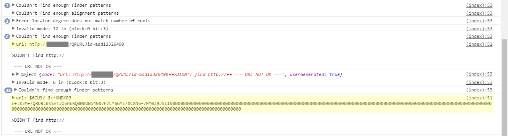

# jsqrcode
Refactoring of lazarsoft/jsqrcode.

See README-original for the original README file.

# Requirements
The web page must be served via https.

The web page must contain a `<video>` element. This element will be automatically resized at runtime to fit the camera's stream.

# Usage
### Import script
```html
<script type="text/javascript" src="src/jsqrcode.js"></script>
```
### Create object
Pass a configuration object to the global `jsqrcode` constructor.
```js
let scanner = new jsqrcode({
	player: document.getElementById('myvideo'),
	scanInterval: 3000, // milliseconds
	autoStartScan: false,
	error: function(e) {
		if (typeof e === "object" && e.userGenerated) {
			console.log(e.code);
		}
	},
	success: function(txt, obj) {
        // validate the decoded text to check for false positives (see section below)
		if ( isDecodedTextValid(txt) ) {
			obj.stopScan();
			alert("decoded: " + txt);
		    obj.player.style.visibility = 'hidden'; // if you want, hide the video player
		} else {
			obj.triggerError({code: 'broken text: ' + txt, userGenerated: true});
		}
	}
});
```

### Start scan
```js
scanner.startScan();
```

### Configuration object
#### Mandatory configuration properties:
- `player` (html element): html `<video>` node
- `success` (function): callback function run when a code is decoded.
  - callback signature: `function(decodedText, obj)`
    - `decodedText` (string) is whatever the script just decoded
    - `obj` (object) is the jsqrcode object itself, so you can call its other methods
  - the callback should check the integrity of the decoded text, as false positives might be present. See section below

#### Optional configuration properties:
- `preferredCamera` (string): camera id of the camera to be used when starting the stream (see `MediaDevices.enumerateDevices()`)
- `error` (function): callback called on decoding error (see section below)
  - it's absolutely optional as decoding errors can be safely ignored
  - callback signature: `function(error, obj)`
    - `error` (object or any) is the Error() object, or whatever has been passed to the `triggerError()` method (see section below)
    - `obj` (object) is the jsqrcode object itself, so you can call its other methods
- `technicalError` (function): callback called on technical error, for example if the user does not give the camera permission, or if the page is served via http instead of https, etc
  - callback signature: `function(error, obj)`
    - `error` (array) contains the error(s)
    - `obj` (object) is the jsqrcode object itself, so you can call its other methods
- `startScanCallback` (function): callback called when the first image is loaded in the html player. Used just for debugging purposes
  - callback signature: `function(obj)`
    - `obj` (object) is the jsqrcode object itself, so you can call its other methods
- `scanInterval` (integer, default: 1000): interval in milliseconds between each scan
- `autoStartScan` (boolean, default: true): if true, `startScan()` (see section below) is automatically called after instantiation
- `autoStopScan` (boolean, default: false): if true, whenever a `success` callback is called, `stopScan()` (see section below) is also called
  - the use of this property is not recommended. It's better to check the integrity of the decoded text inside of the `success` callback, and if and only if the text is valid, call `stopScan()`. See section below
- `posterizePlayer` (boolean, default: true): if true, when `stopScan()` is called, the last frame scanned by the camera is saved to the player
- `debug` (boolean, default: false): if true, the internal canvas used for decoding, will work in blue scale instead of colors. This can help in seeing what the script really does internally. Also, it will stop execution before each snapshot via a `debugger` statement


### Public methods and properties
#### Main methods
- `startScan(devId)`: starts the camera stream and the scanning using the camera with id equal to the given `devId`.
  - `devId`: string
  - if `devId` is not specified, the method fallbacks to using `preferredCamera`
  - if `devId` (or the fallback `preferredCamera`) is not a valid camera id for the system (see `MediaDevices.enumerateDevices()`), the first camera exposed by the system's apis will be used
- `nextCamera()`: cycles to the next camera, if the system has multiple cameras
- `stopScan()`: stops the camera stream and the decoding
- `scanning()`: returns `true` if scanning is in progress, else `false`
- `getCameras()`: returns an array of the system's cameras. The one with index `0` is the active camera

#### Secondary methods
- `triggerError(err)`: used to manually trigger an error (see section below). `err` will be passed to the `error` callback, if present. This method does not stop the scanning
  - `err`: any (should be object)
- `setOption(name, value)`: overwrites a contructor property (see section above)
  - `name`: string
  - `value`: any
- `getOption(name)`: returns the current value of constructor property (see section above)
  - `name`: string
- `getLastSnapshot()`: returns the data URL of the latest camera snapshot analyzed

#### Properties
- `player` (html element): the player property passed to the constructor
- `snapshotCanvas` (html element): canvas element used internally to decode data. It is not attached to the document, as it resides only in memory

# Errors and false positives
The `error` callback is called whenever decoding of the current snapshot it's not possible. You should take this into consideration if you set an `error` callback, as it may generate an error every second (or any interval of `scanInterval` milliseconds)!

These decoding errors can be safely ignored, the `error` callback really should be used only for debugging purposes.

The same cannot be said for false positives.

False positives are decoding errors that are instead considered valid.

An example of a false positive might be the following:
- original string encoded inside the qr code: `ciao`
- decoded string (false positive): `ciao%33%0%0%0%0%0`

So the best practice would be to validate each decoded text inside the `success` callback, via any check you consider necessary. For example, if the qr code represents an url, you could check that the decoded text is a valid url. Or, if you can alter the qr codes you will scan, you could generate qr codes containing an hash at the end of the string, and then check if the hash is correct inside your `success` callback.

If, after your validation, you found that the text is invalid (hence it's a false positive), you should call `obj.triggerError()` and pass an object representing the error (which will be passed to the `error` callback).

Here you can see a couple of false positives (highlighted in yellow):



# Technical notes
- LazarSoft's (Lazar Laszlo's) code is identified by `lzl_` prefixes
- ZXing's code is identified internally by `xyz_` prefixes
- everything is wrapped in an IIFE to avoid polluting the global namespace. The only global property set by this software is the constructor, `window.jsqrcode`
- ES6+ has been used in the refactoring